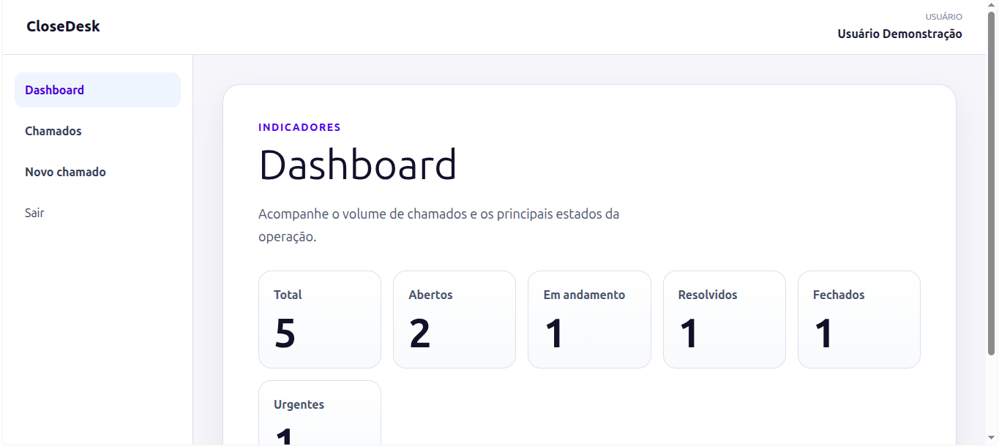
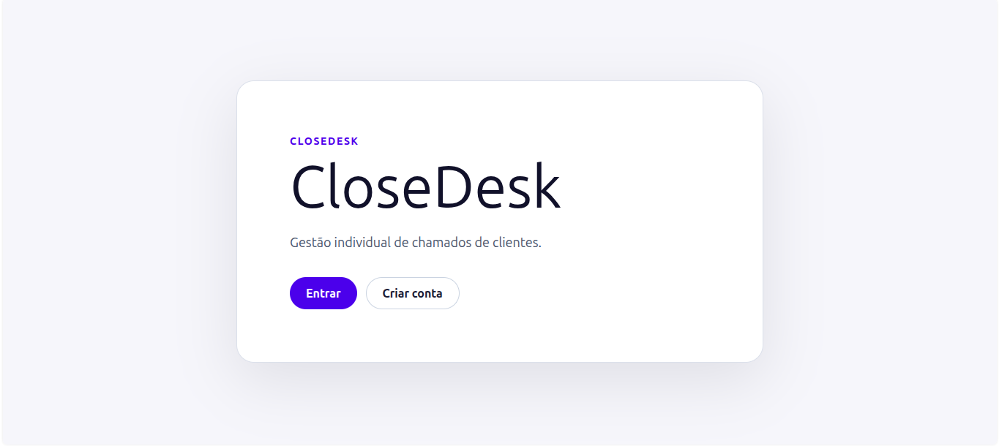
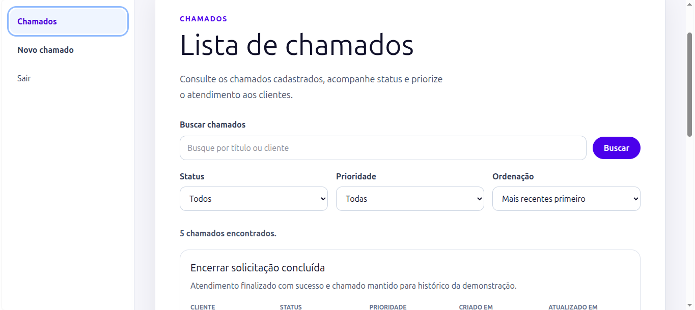
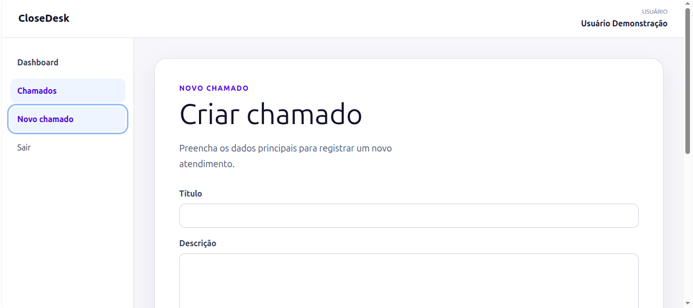
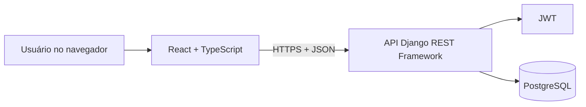

# CloseDesk

Aplicação web full stack para gestão individual de chamados de clientes.

## Demo

- Frontend: <https://close-deskk.vercel.app>
- Backend: <https://close-desk.onrender.com>
- Health check: <https://close-desk.onrender.com/api/health/>
- Documentação da API: <https://close-desk.onrender.com/api/docs/>

> O backend está hospedado em plano gratuito. A primeira requisição pode levar
> alguns segundos enquanto o serviço desperta.

## Screenshots

| Home                                                           | Login                                                            |
| -------------------------------------------------------------- | ---------------------------------------------------------------- |
|  |  |

| Lista de chamados                                                       | Novo chamado                                                                         |
| ----------------------------------------------------------------------- | ------------------------------------------------------------------------------------ |
|  |  |

## Sobre o projeto

O CloseDesk centraliza chamados, prioridades, status e prazos em uma aplicação
individual. O MVP foi construído para profissionais autônomos e pequenos
prestadores de serviço que precisam acompanhar seus próprios atendimentos sem
misturar dados entre usuários.

O projeto cobre o ciclo completo de uma aplicação full stack:

- levantamento de requisitos;
- roadmap de implementação;
- API REST autenticada;
- frontend integrado;
- testes automatizados;
- documentação;
- deploy em produção;
- validação de fluxos de aceitação.

## Funcionalidades

- Cadastro e login por e-mail e senha.
- Recuperação de senha por e-mail.
- Verificação de e-mail não bloqueante após cadastro.
- Sessão com JWT, refresh token e restauração de sessão.
- Rotas protegidas no frontend e endpoints protegidos no backend.
- CRUD completo de chamados.
- Alteração de status e prioridade.
- Busca por título ou cliente.
- Filtros por status e prioridade.
- Ordenação por data de criação.
- Paginação.
- Dashboard com total de chamados, contagem por status e chamados urgentes.
- Isolamento de dados por usuário.
- Estados de carregamento, erro e lista vazia.
- Mensagens de validação associadas aos campos.
- Documentação OpenAPI/Swagger.

## Stack

| Camada          | Tecnologias                                                |
| --------------- | ---------------------------------------------------------- |
| Frontend        | React, TypeScript, Vite, React Router, Axios, Tailwind CSS |
| Backend         | Python, Django, Django REST Framework, Simple JWT          |
| Banco de dados  | PostgreSQL                                                 |
| Testes backend  | pytest, pytest-django                                      |
| Testes frontend | Vitest, Testing Library, MSW                               |
| Testes E2E      | Playwright                                                 |
| Qualidade       | Ruff, ESLint, Prettier                                     |
| Deploy          | Render, Render PostgreSQL, Vercel                          |
| CI              | GitHub Actions                                             |

## Arquitetura

O frontend React consome uma API Django REST por JSON. O backend concentra
autenticação, autorização, validações, regras de negócio e persistência.



Responsabilidades principais:

- O frontend renderiza a interface, gerencia estado de tela e consome a API.
- O backend é a fonte de verdade das regras de negócio.
- O isolamento dos chamados por usuário é aplicado no backend.
- Segredos e configurações sensíveis ficam fora do Git.

Veja mais em [docs/arquitetura.md](docs/arquitetura.md).

## Principais endpoints

| Método   | Rota                                     | Descrição                         |
| -------- | ---------------------------------------- | --------------------------------- |
| `GET`    | `/api/health/`                           | Verifica se a API está online.    |
| `POST`   | `/api/auth/register/`                    | Cadastra usuário.                 |
| `POST`   | `/api/auth/token/`                       | Autentica e retorna tokens JWT.   |
| `POST`   | `/api/auth/token/refresh/`               | Renova o access token.            |
| `GET`    | `/api/auth/me/`                          | Retorna o usuário autenticado.    |
| `POST`   | `/api/auth/password-reset/`              | Solicita recuperação de senha.    |
| `POST`   | `/api/auth/password-reset/confirm/`      | Confirma nova senha.              |
| `POST`   | `/api/auth/email-verification/confirm/`  | Confirma verificação de e-mail.   |
| `GET`    | `/api/tickets/`                          | Lista chamados paginados.         |
| `POST`   | `/api/tickets/`                          | Cria chamado.                     |
| `GET`    | `/api/tickets/:id/`                      | Exibe detalhes de um chamado.     |
| `PATCH`  | `/api/tickets/:id/`                      | Atualiza parcialmente um chamado. |
| `DELETE` | `/api/tickets/:id/`                      | Exclui chamado.                   |
| `GET`    | `/api/dashboard/summary/`                | Retorna indicadores do dashboard. |

A listagem aceita `search`, `status`, `priority`, `ordering` e `page`.

## Como rodar localmente

### Backend

```bash
python3 -m venv backend/.venv
source backend/.venv/bin/activate
python -m pip install -r backend/requirements-dev.txt
cp backend/.env.example backend/.env
```

Preencha `backend/.env` com valores locais e carregue as variáveis:

```bash
set -a
source backend/.env
set +a
```

Prepare o banco e rode a API:

```bash
python backend/manage.py migrate
python backend/manage.py runserver 127.0.0.1:8000
```

### Frontend

Em outro terminal:

```bash
cd frontend
npm install
cp .env.example .env
npm run dev
```

Configure `frontend/.env` com:

```env
VITE_API_BASE_URL=http://localhost:8000/api
```

A aplicação fica disponível em:

```text
http://localhost:5173
```

## Variáveis de ambiente

### Backend

```env
DJANGO_SECRET_KEY=change-me
DJANGO_DEBUG=True
DJANGO_ALLOWED_HOSTS=localhost,127.0.0.1

POSTGRES_DB=closedesk
POSTGRES_USER=closedesk
POSTGRES_PASSWORD=change-me
POSTGRES_HOST=localhost
POSTGRES_PORT=5432

CORS_ALLOWED_ORIGINS=http://localhost:5173
FRONTEND_BASE_URL=http://localhost:5173

EMAIL_BACKEND=django.core.mail.backends.console.EmailBackend
EMAIL_HOST=localhost
EMAIL_PORT=25
EMAIL_HOST_USER=
EMAIL_HOST_PASSWORD=
EMAIL_USE_TLS=False
EMAIL_USE_SSL=False
DEFAULT_FROM_EMAIL='CloseDesk <no-reply@closedesk.local>'
```

### Frontend

```env
VITE_API_BASE_URL=http://localhost:8000/api
```

Os arquivos `.env` reais são ignorados pelo Git.

## Testes e qualidade

### Backend

```bash
cd backend
python -m ruff check .
python -m ruff format --check .
python manage.py check --settings=config.settings_test
python -m pytest -q
```

### Frontend

```bash
cd frontend
npm run build
npm run lint
npm run test
npm run format:check
npm run e2e
```

O pipeline de CI executa verificações de backend, frontend e E2E em pull
requests e pushes para `main`.

## Deploy

- Backend: Render Web Service.
- Banco de dados: Render PostgreSQL.
- Frontend: Vercel.

O backend usa Gunicorn e WhiteNoise em produção. O frontend é publicado como
aplicação estática Vite com rewrite para rotas do React Router.

Veja o plano e as URLs em [docs/deploy.md](docs/deploy.md).

## Validação

Os cinco fluxos de aceitação foram validados em produção:

1. Primeiro acesso.
2. Gestão completa de chamado.
3. Consulta avançada.
4. Isolamento entre usuários.
5. Sessão e segurança.

Registro completo: [docs/testes/fluxos-de-aceitacao.md](docs/testes/fluxos-de-aceitacao.md).

## Decisões e trade-offs

Principais decisões registradas:

- autenticação por e-mail;
- armazenamento do access token em memória e refresh token em `sessionStorage`;
- isolamento dos chamados por usuário no backend;
- exclusão física no MVP;
- configuração por variáveis de ambiente;
- estrutura padronizada de erros da API.

Veja os ADRs em [docs/decisoes](docs/decisoes).

Trade-offs do MVP:

- não há organizações, equipes ou papéis administrativos;
- não há recuperação de senha;
- não há comentários, anexos ou notificações;
- exclusão de chamados é física;
- o refresh token não é revogado no servidor ao fazer logout.

## Evoluções futuras

- Organizações e equipes.
- Papéis de acesso.
- Histórico de alterações.
- Comentários e anexos.
- Notificações.
- Recuperação de senha, priorizada após feedback pós-publicação.
- Verificação de e-mail, priorizada após feedback pós-publicação.
- Auditoria e métricas operacionais.

## Documentação

- [Requisitos](docs/requisitos.md)
- [Roadmap](docs/roadmap.md)
- [Arquitetura](docs/arquitetura.md)
- [Rastreabilidade](docs/rastreabilidade.md)
- [Feedback pós-publicação](docs/feedback-pos-publicacao.md)
- [Backend](backend/README.md)
- [Frontend](frontend/README.md)
- [Fluxos de aceitação](docs/testes/fluxos-de-aceitacao.md)
- [Plano de deploy](docs/deploy.md)
