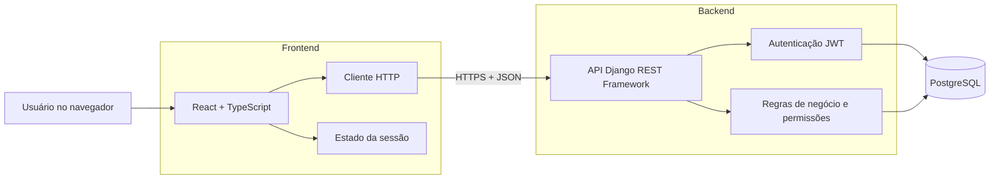
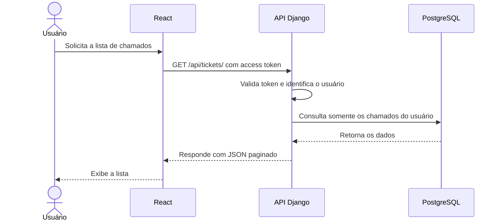

# Arquitetura do CloseDesk

## Visão geral

O CloseDesk utiliza uma arquitetura cliente-servidor. O frontend React é responsável pela interface, enquanto a API Django concentra autenticação, regras de negócio, permissões e persistência.

## Responsabilidades

### Frontend

- Renderizar páginas e componentes.
- Validar formulários para melhorar a experiência.
- Manter o estado da interface e da sessão.
- Consumir a API e apresentar carregamento, sucesso e erro.
- Proteger a navegação de usuários sem sessão.

O frontend não decide se um usuário pode acessar determinado chamado. Essa autorização pertence ao backend.

### Backend

- Cadastrar e autenticar usuários.
- Emitir e validar tokens JWT.
- Validar todos os dados recebidos.
- Aplicar regras de negócio.
- Garantir o isolamento dos chamados por usuário.
- Consultar e persistir dados no PostgreSQL.
- Produzir respostas e erros consistentes.
- Publicar a documentação OpenAPI.

### Banco de dados

- Armazenar usuários e chamados.
- Preservar relacionamentos e restrições.
- Apoiar consultas, filtros, ordenação e indicadores.

O banco de dados não será acessado diretamente pelo frontend.

## Fluxo de uma requisição autenticada

## Princípios

- A API é a fonte de verdade das regras de negócio.
- Toda autorização é aplicada no backend.
- Cada usuário acessa somente os próprios chamados.
- O frontend e o backend se comunicam por JSON.
- Segredos permanecem no backend e fora do Git.
- As camadas podem ser testadas separadamente.
